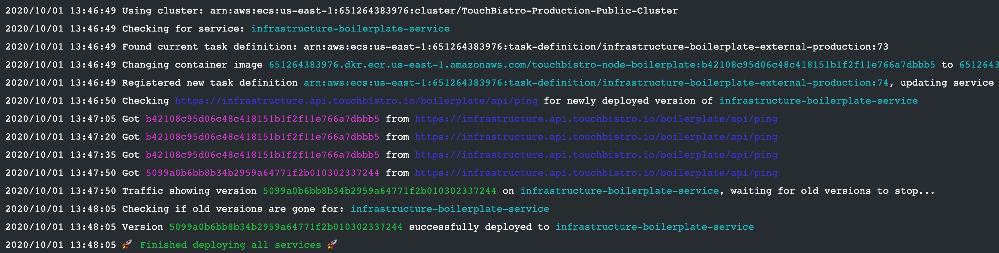

# Gehen

Gehen is a mininal version update aid for ECS services.
It makes it easy to deploy updates to ECS services, waits for the cutover to complete, and recovers if the deployment fails.



## How it works

#### Deployment

Gehen assumes that docker images are tagged with the Git SHA of the corresponding commit.
This makes it easy to identify which version of the code is in a given image.

Gehen will register a new task definition in ECS for your service and update the image tag to be the new Git SHA provided.
It will then update the ECS service to use the new task definition and trigger a new deployment.

**NOTE:** Gehen assumes the service already exists in ECS. It will not create services for you.

#### Deploy Check

Gehen can be configured to ping your service to see if the new version has been deployed.
For this to work your service must send the [Server](https://developer.mozilla.org/en-US/docs/Web/HTTP/Headers/Server) header with the format `*-GITSHA` where `GITSHA` is the Git SHA you provided to Gehen to update the service to. An example header is `Server: infrastructure-boilerplate-production-api-da39a3ee5e6b4b0d3255bfef95601890afd80709`.

To enable this feature set the `url` field under your service's configuration to the appropriate ping URL.

Gehen will keep hitting the URL provided for your services until it either sees the new Git SHA in the header, or times out. The default timeout duration is 5 minutes.

#### Drain Check

Once Gehen sees that the new version of the service has deployed it will wait for the old version(s) to drain.
A service has drained when the old version is unreachable by the load balancer.
Gehen also waits until the number of running tasks matches the expected amount of tasks in ECS.
The default timeout duration is 5 minutes.

#### Rollback

If the deployment or deploy check steps fail, Gehen will automatically roll back the service to the previous version.
It will then go through the same deploy check and drain check processes to ensure the roll back was successful.

## Usage

```
Usage of ./gehen:
  -gitsha string
        The gitsha of the version to be deployed
  -path string
        The path to a gehen.yml config file (default "gehen.yml")
  -version
        Prints the current gehen version
```

### Exit codes

Gehen uses exit codes to communicate the result of a deployment. The following exit codes are used:

- `0`: The deployment succeeded.
- `1`: The deployment failed.
- `2`: The timeout was reached. Gehen was unable to determine if the deployment was successful.

## Configuration

Gehen is configured through a `gehen.yml` file. This contains the list of ECS services to deploy to. You can specify multiple services to deploy the service to multiple environments.

The schema is as follows:

```yaml
updateStrategy: current | latest | none # Which task definition revision should be used
services: # A map of services
  <service-name>: # The name of the ECS service
    cluster: string # The ECS cluster the service is in
    url: string # The URL to use to check that the new version has been deployed
scheduledTasks: # A map of ECS scheduled tasks
  <scheduled-task-name>: # The name of the ECS scheduled task
timeoutMinutes: int # How many minutes to wait for the deploy check and drain check
```

An example config is provided in [gehen.example.yml](gehen.example.yml).

### `updateStrategy`

This field determines how services are updated.

The possible values are:

- `current`: Create a new task definition based off the revision the service is currently using.
- `latest`: Create a new task definition based off the latest revision available.
- `none`: Disable updating services. This prevents Gehen from deploying a new version of the service.

## Contributing

See [contributing](CONTRIBUTING.md) for instructions on how to contribute to `gehen`. PRs welcome!

## License

MIT © TouchBistro, see [LICENSE](LICENSE) for details.
